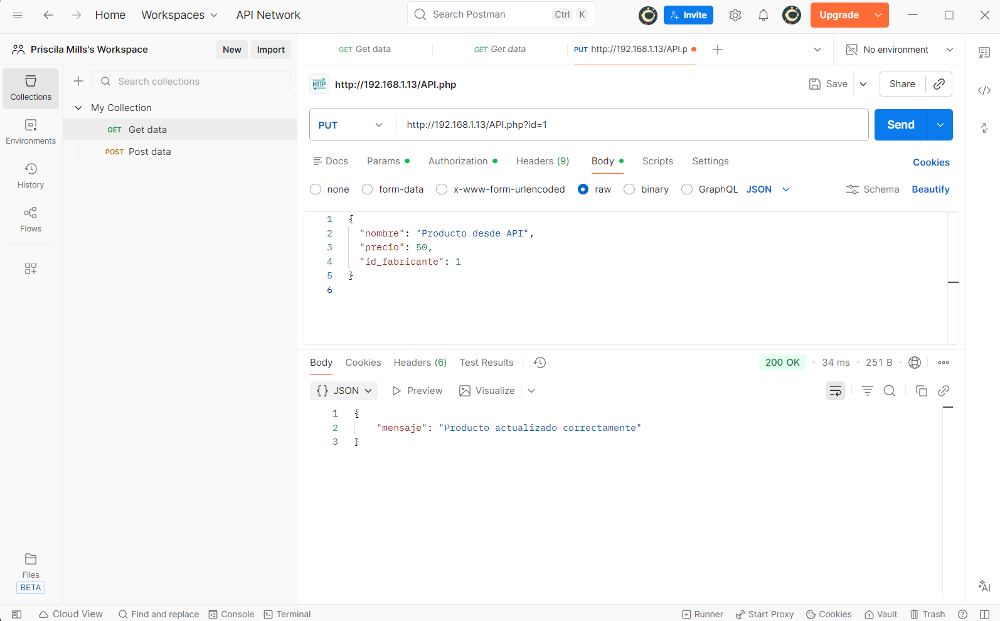

# 1️⃣ API REST PHP – Paso 1 (GET)

API REST en PHP que permite consultar los productos almacenados en la base de datos `tienda`.

## Endpoints
- GET /api.php
- GET /api.php?id=1

La respuesta se devuelve en formato JSON.

## 📮Postman – Cómo probar el GET 

<details>

<summary>Desplegar para ver pasos a seguir</summary>

### 1️⃣ Abrir Postman

* Abre **Postman** en el sistema principal si estas conectado a la ip de la MV.
* Abre **Postman** en el sistema que estés usando en cualquier otro caso.

---

### 2️⃣ Crear una petición nueva

* Pulsa **New**
* → **HTTP Request**

---

### 3️⃣ Configuración básica (arriba)

* **Method**: `GET`
* **URL**:

  ```
  http://192.168.1.13/API.php
  ```

---

### 4️⃣ Enviar

* Pulsa **Send**

👉 Debe salir **el mismo JSON** que ves en el navegador.

---

## 🔎 Probar GET con id

* Cambia la URL a:

  ```
  http://192.168.1.13/API.php?id=1

  ```
* Pulsa **Send**

👉 Debe devolver **un solo producto en JSON**.

<p align="center">
   
</p>

</details>

---

# 2️⃣ API REST – Paso 2 (POST con Bearer Token)

Se amplía la API REST para permitir la inserción de nuevos productos en la base de datos mediante peticiones HTTP POST.

### Características
- Método POST
- Inserción en la tabla `producto`
- Uso de consultas parametrizadas (PDO)
- Autorización mediante Bearer Token
- Respuesta en formato JSON indicando éxito o error

Las peticiones POST se realizan usando la herramienta Postman.

## 📮 Postman – Cómo probar el POST 

<details>

<summary>Desplegar para ver pasos a seguir</summary>

### 1️⃣ Método y URL

* Method: **POST**
* URL:

```
http://192.168.1.13/API.php
```

---

### 2️⃣ Authorization

* Tipo: **Bearer Token**
* Token:

```
123ABC
```

---

### 3️⃣ Body

* Tipo: **raw**
* Formato: **JSON**

```json
{
  "nombre": "Producto prueba API",
  "precio": 99.99,
  "id_fabricante": 1
}
```

---

### 4️⃣ Send

Respuesta esperada:

```json
{
  "mensaje": "Producto insertado correctamente"
}
```

Compruébalo luego con:

```
GET /API.php
```
<p align="center">
   
</p>

</details>

</details>

---

> [!WARNING]
> ❌Posibles problemas con la BBDD
<details>
<summary>Soluciones ⬇️</summary>

---

Dentro de `psql`:

```sql
\c tienda
```

## ✅ Ejecuta esto

```sql
\d producto;
```

## ✅ Problemas con el id.

### Opción recomendada (PostgreSQL moderno):

```sql
ALTER TABLE producto
ALTER COLUMN id ADD GENERATED ALWAYS AS IDENTITY;
```

### Si da error, alternativa segura:

```sql
CREATE SEQUENCE producto_id_seq;
ALTER TABLE producto
ALTER COLUMN id SET DEFAULT nextval('producto_id_seq');
```
---

## 👉 Si el autoincremento existe, pero el contador interno va mal.
PostgreSQL intenta volver a usar un id que ya existe.

### ✅ Solución

En `psql`, **conectada a `tienda`**:

```sql
SELECT setval(
  pg_get_serial_sequence('producto','id'),
  (SELECT MAX(id) FROM producto)
);

```

Esto:

* busca el `id` más alto
* ajusta el contador interno
* evita duplicados

</details>

---

# 3️⃣ API REST – Tarea evaluable (PUT y DELETE)

Se amplía la API REST para permitir la modificación y eliminación de productos mediante los verbos HTTP PUT y DELETE.

### Características
- Método PUT: modifica todos los campos de un producto dado su id
- Método DELETE: elimina un producto dado su id
- Uso obligatorio de Bearer Token
- El id del producto se pasa por parámetro GET
- Respuesta en formato JSON indicando éxito o error

---
## 📮 Postman – Cómo probar PUT y DELETE
<details>
<summary>Desplegar para ver pasos a seguir</summary>

### 🔁 PUT

* Método: **PUT**
* URL:

```
http://192.168.1.13/API.php?id=1
```

* Authorization → Bearer Token → `123ABC`
* Body → raw → JSON:

```json
{
  "nombre": "Producto modificado",
  "precio": 999,
  "id_fabricante": 1
}
```

Respuesta esperada:

```json
{ "mensaje": "Producto actualizado correctamente" }
```

---

### ❌ DELETE

* Método: **DELETE**
* URL:

```
http://192.168.1.13/API.php?id=1
```

* Authorization → Bearer Token → `123ABC`

Respuesta esperada:

```json
{ "mensaje": "Producto eliminado correctamente" }
```
### PUT
<p align="center">
   
</p> 

### DELETE
<p align="center">
   
</p>


</details>


