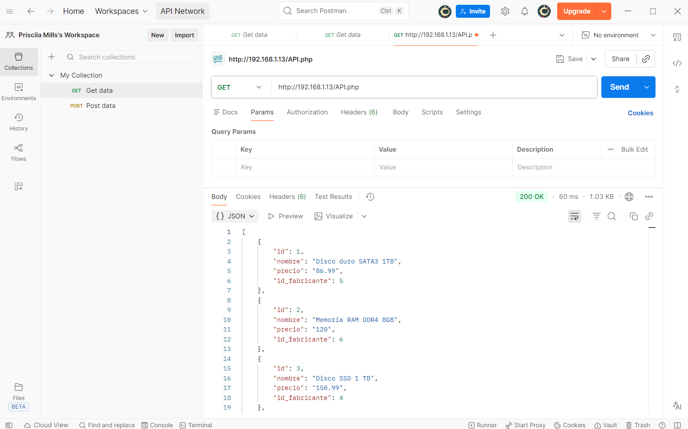

# API REST PHP – Paso 1 (GET)

API REST en PHP que permite consultar los productos almacenados en la base de datos `tienda`.

## Endpoints
- GET /api.php
- GET /api.php?id=1

La respuesta se devuelve en formato JSON.

Perfecto, te lo explico **muy simple y práctico**, solo lo justo para **esta API** 👇

---

## 📮 Cómo usar Postman (PASO 1 – GET)

<details>

<summary>Desplegar para ver pasos a seguir</summary>

### 1️⃣ Abrir Postman

* Abre **Postman** en el sistema principal si estas conectado a la ip de la MV.
* Abre **Postman** en el sistema que estés usando en cualquier otro caso.

---

### 2️⃣ Crear una petición nueva

* Pulsa **New**
* → **HTTP Request**

---

### 3️⃣ Configuración básica (arriba)

* **Method**: `GET`
* **URL**:

  ```
  http://192.168.1.13/API.php
  ```

---

### 4️⃣ Enviar

* Pulsa **Send**

👉 Debe salir **el mismo JSON** que ves en el navegador.

---

## 🔎 Probar GET con id

* Cambia la URL a:

  ```
  http://192.168.1.13/API.php?id=1
  ```
* Pulsa **Send**

👉 Debe devolver **un solo producto en JSON**.

<p align="center">
   
</p>

</details>

---

## API REST – Paso 2 (POST con Bearer Token)

Se amplía la API REST para permitir la inserción de nuevos productos en la base de datos mediante peticiones HTTP POST.

### Características
- Método POST
- Inserción en la tabla `producto`
- Uso de consultas parametrizadas (PDO)
- Autorización mediante Bearer Token
- Respuesta en formato JSON indicando éxito o error

Las peticiones POST se realizan usando la herramienta Postman.

---

## 📮 Postman – Cómo probar el POST (OBLIGATORIO)

<details>

<summary>Desplegar para ver pasos a seguir</summary>
### 1️⃣ Método y URL

* Method: **POST**
* URL:

```
http://192.168.1.13/API.php
```

---

### 2️⃣ Authorization

* Tipo: **Bearer Token**
* Token:

```
123ABC
```

---

### 3️⃣ Body

* Tipo: **raw**
* Formato: **JSON**

```json
{
  "nombre": "Producto prueba API",
  "precio": 99.99,
  "id_fabricante": 1
}
```

---

### 4️⃣ Send

Respuesta esperada:

```json
{
  "mensaje": "Producto insertado correctamente"
}
```

Compruébalo luego con:

```
GET /API.php
```
<details>
---

